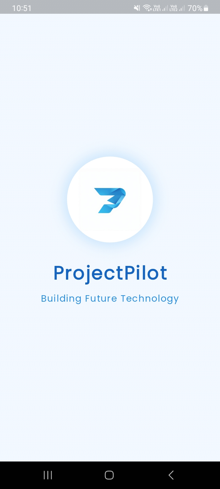

# 🚀 ProjectPilot Project Management System
> *Crafted with Excellence by Kalhara Wimukthi*

<div align="center">
  
[](https://flutter.dev/)
[](https://firebase.google.com/)
[](https://github.com/kalharawimukthi/technoyuga)
[](https://github.com/kalharawimukthi/technoyuga/releases)

<div align="center">
  
</div>


### [📱 Download APK](https://github.com/kalharawimukthi0617/Project-Management-System/releases/download/project/ProjectPilot.apk)

</div>

---

## 🌟 App Showcase

<div align="center">
  
  
  
  
  
  
  
  
  
  
  
  
  
  
  
  
  
  
</div>

## ✨ Features That Shine

<table>
<tr>
<td>

### 👥 For Clients
- Submit project proposals seamlessly
- Track real-time project progress
- Interactive dashboard

</td>
<td>

### 👨‍💻 For Developers
- Manage assigned projects
- Update project status
- Progress tracking tools

</td>
<td>

### 👑 For Admins
- Comprehensive project oversight
- Team management
- Proposal approval system

</td>
</tr>
</table>

## 🛠️ Built With Excellence

<table>
<tr>
<td>

### Frontend Magic
- Flutter SDK
- Provider State Management
- Custom Animations
- Material Design 3.0

</td>
<td>

### Backend Power
- Firebase Authentication
- Cloud Firestore
- Real-time Database

</td>
<td>

### Architecture
- Clean Architecture
- MVVM Pattern
- Repository Pattern
- Factory Pattern

</td>
</tr>
</table>

## 🔐 Quick Access Guide

### Admin Access
```yaml
Email: admin@gmail.com
Password: 12345678
Role: Super Admin
Access: Full System Control
```

### Client Journey
1. Register/Login
2. Submit Project Proposal
3. Track Progress

### Developer Workflow
1. Register/Login
2. Access Assigned Projects
3. Report Progress

## 🎨 Design Philosophy

My app follows a modern, user-centric design approach with:

- **Intuitive Navigation**: Seamless user journey through the app
- **Responsive Design**: Perfect display on all screen sizes
- **Material Design**: Following latest design guidelines
- **Custom Animations**: Enhancing user experience
- **Light Themes**: Comfortable viewing options

## 💎 Technical Excellence

- Clean Architecture for maintainable code
- MVVM pattern for separation of concerns
- Repository pattern for data management
- Factory pattern for object creation
- Observer pattern for real-time updates

## 🔥 Special Features

- Real-time Progress Tracking
- Multi-role Authentication
- Interactive Dashboards

## 📫 Support & Feedback

For support, feature requests, or bug reports:
- Create an issue on GitHub
- Email: <a href="mailto:kalharawimukthi0617@gmail.com">kalharawimukthi0617@gmail.com</a>

---

<div align="center">

### Created with 💖 by [Kalhara Wimukthi]([https://github.com/kalharawimukthi](https://www.linkedin.com/in/kalhara-wimukthi-748043229/))

</div>

